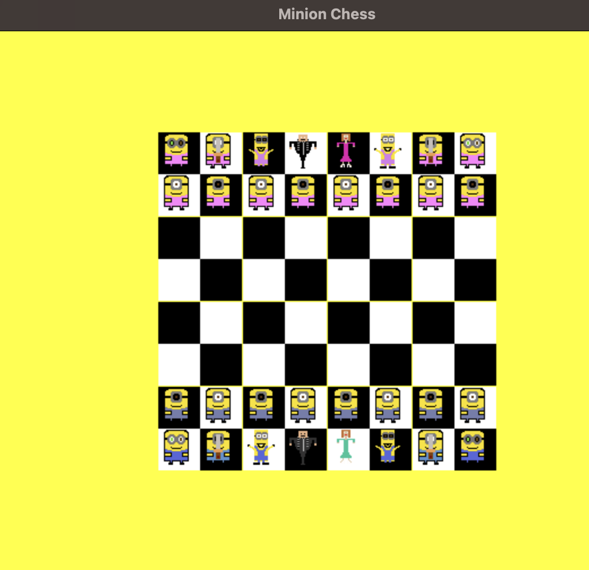

# MinionChess

a chess game with minions as figures

# todos
* put sprites in the right position --> done
* make a sprite for the queen and the knight
* add a pattern for sprites to move
* add move function for each class
* add mechanic for throwing figures