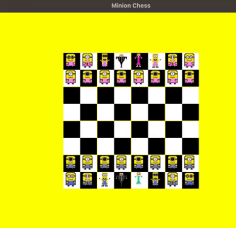

# MinionChess

a chess game with minions as figures

  

# todos
* put sprites in the right position --> done
* make a sprite for the queen and the knight -->
* add a pattern for sprites to move
* add move function for each class --> done
* add mechanic for throwing figures --> done
* fix the bug where they throw their own figure
* add a field where you can see which figures have been captured
* add castle function
* add en passant
